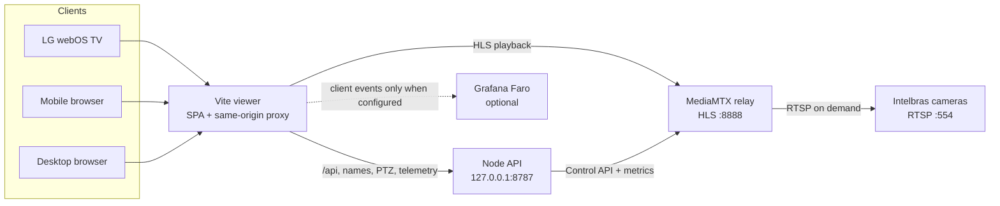
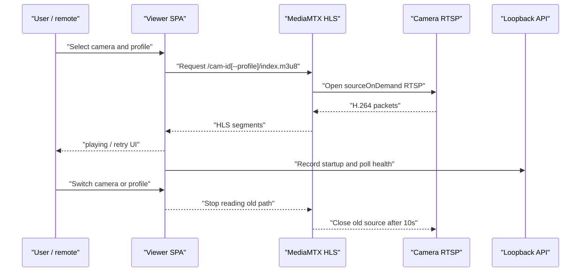

# Intelbras TV Viewer

Stage 1 is a local, remote-friendly LG TV viewer for Intelbras RTSP cameras. The
React/Vite SPA provides the single-player TV interface, a loopback Node API
handles names, PTZ, snapshots, and telemetry, and MediaMTX converts the
selected RTSP feed into browser-compatible HLS. The bridge stays local to the
camera network; only the viewer and HLS ports are intended for LAN access.

The repository is deliberately split into three runtime boundaries:



The API, MediaMTX control API, metrics, RTSP, SQLite file, and camera
credentials remain on the Linux bridge. `CAMERA_PASSWORD` is read by the
backend and relay generator only; it must never be placed in a `VITE_*`
variable or browser storage.

The server is a small Hono application assembled in [`server/app.ts`](server/app.ts)
from focused modules: [`server/config.ts`](server/config.ts) owns validated
loopback settings and credentials, while the camera-name repository,
reliability service, snapshot service, and PTZ transport each own one runtime
concern. [`server/index.ts`](server/index.ts) wires production dependencies and
lifecycle. There is no separate `server/camera-credentials.ts`; credential
loading is part of the central server configuration.

## Quick start

Requirements: Node.js 24+, pnpm 10+, Docker Compose, and a Linux bridge that
can reach the cameras and the TV. For a first local run:

```bash
cp .env.example .env
chmod 600 .env
# Edit only the local, ignored .env and set CAMERA_PASSWORD.
pnpm relay:up
pnpm dev
```

Open `http://localhost:8080` on the bridge or the LAN URL printed by
`pnpm dev` on the TV/mobile browser. For the production-compatible TV server,
run `pnpm serve` after the relay is up. The full firewall, TV, and troubleshooting
instructions are below.

## How a stream starts

Each camera/profile has a deterministic relay path generated from the shared
inventory and `src/config/stream-profiles.json`. The SPA requests only the HLS
URL; MediaMTX opens the matching RTSP source when that path is first read and
closes it after the configured idle delay. The API's reliability polling is
independent of playback, so telemetry failures do not stop or retry the video.



The live + glance wall uses the same low-resolution (`subtype=1`) relay for
short-lived JPEG snapshots. It never creates a second HLS `<video>` player;
selecting a tile promotes that camera to the single live player.

The interface uses `i18next` and defaults to Brazilian Portuguese (`pt-BR`). A PT/EN control changes the language locally and persists the preference in browser storage; camera credentials never enter that storage.

Camera display names are stored locally in SQLite by a small loopback API. The normal development command starts the API and Vite together:

```bash
pnpm dev
```

The API listens only on `127.0.0.1:8787`; Vite proxies `/api` to it for the TV. Names are stored in `runtime/cameras.sqlite` (ignored by Git), limited to 80 characters, and can be cleared from the rename dialog to restore the translated default. The database contains camera IDs and names only—never RTSP URLs, usernames, or passwords. Set `CAMERA_DB_PATH` or `CAMERA_API_PORT` when running the local API if needed.

## Why this shape

- Camera credentials remain on the Linux bridge and never enter browser JavaScript.
- Only one stream is active at a time, matching LG webOS's officially supported single-video playback model.
- All twelve authenticated cameras emit H.264 streams, so MediaMTX relays without transcoding.
- Camera `.116` has an unknown physical model, but is available through the same shared relay credentials as the other cameras.

## Shared camera inventory

The complete non-secret inventory lives in [`src/config/camera-inventory.json`](src/config/camera-inventory.json). It is consumed by both the React catalog and `scripts/generate-mediamtx-config.mjs`, so adding a camera or changing its model/IP does not require maintaining two lists. The inventory currently contains:

| Cameras                                | Model                            | State     |
| -------------------------------------- | -------------------------------- | --------- |
| `.114`, `.115`, `.123`, `.127`, `.129` | iM5-SC                           | Available |
| `.121`, `.124`, `.125`                 | iM7-FC                           | Available |
| `.126`, `.135`                         | iME-360-C                        | Available |
| `.122`                                 | Intelbras camera (model unknown) | Available |
| `.116`                                 | Intelbras camera (model unknown) | Available |

The catalog uses generic model/IP labels until physical locations are confirmed. Select any card and use **Renomear** to assign names such as `Garage`, `Gate`, or `Backyard`; clearing the name restores the generic label. Names are keyed by stable camera ID in SQLite, including `.116`, so no code change is needed for normal renaming. The `locked` availability state remains supported generically for future cameras.

The inventory marks `.124` (`cam-124`) as the single default camera. A fresh viewer load opens its first available stream profile and starts the catalog on the page containing `.124`; the default is validated as exactly one available entry in both the React config and MediaMTX generator.

## Requirements

- Node.js 24+
- pnpm 10+
- Docker with Compose
- Linux bridge and TV on the same local network

## Configure

All Node services and the MediaMTX generator load the same local `.env` file
with Node's built-in env-file support. Vite also loads `.env` for build-time
`VITE_*` settings. `.env` is ignored by Git; never commit it or put a camera
password in browser-facing `VITE_*` variables. `CAMERA_PASSWORD` is read only
by the backend and relay generator. The generated MediaMTX file is mode `600`
and ignored by Git.

Create the local environment file:

```bash
cp .env.example .env
# Edit CAMERA_PASSWORD in the ignored .env file. Keep the file mode restrictive.
chmod 600 .env
```

The example value above is a placeholder only. Replace it locally and never
paste a real password into this README, `.env.example`, source code, Git, or a
browser URL. If `CAMERA_PASSWORD` is absent, backend credential use and relay
generation fail clearly without echoing the password.

The supported local variables are listed in [`.env.example`](.env.example):
`CAMERA_PASSWORD` and `CAMERA_USERNAME` are backend/relay credentials;
`CAMERA_API_HOST`, `CAMERA_API_PORT`, and `CAMERA_DB_PATH` control the loopback
API; `MEDIAMTX_API_URL` and `MEDIAMTX_METRICS_URL` point to loopback
MediaMTX; `SNAPSHOT_FFMPEG` and `SNAPSHOT_RTSP_ORIGIN` configure local
snapshot capture; and `TV_HOST`/`TV_PORT` configure the static TV server.
`VITE_HLS_ORIGIN` and the `VITE_FARO_*`/`VITE_APP_VERSION` values are public
browser settings. `FARO_SOURCE_MAP_*` values are Node/CI-only upload settings;
the API key must never use a `VITE_` prefix.

## Run Stage 1

Terminal 1:

```bash
pnpm relay:up
pnpm relay:logs
```

Terminal 2 (API plus Vite viewer):

```bash
pnpm dev
```

The command prints every active non-loopback IPv4 address. Use the printed
`LAN` URL, for example `http://<BRIDGE_IP>:8080`; do not rely on a stale
DHCP address. Vite is pinned to port 8080 and fails loudly if another process
already owns it, avoiding an accidental fallback to 8081. The API remains
loopback-only and is reachable from the TV/iPhone through Vite's same-origin
`/api` proxy.

For an LG/webOS TV, use the production LAN server after building. It serves the
hashed static assets, legacy browser bundle, pre-React boot screen, and proxies
same-origin `/api` requests to the loopback API on the Linux host:

```bash
pnpm serve
```

Then open the printed `http://<LAN_IP>:8080` address. `pnpm dev` remains the
development/HMR path. The production build targets Chromium 38-era webOS
browsers, includes `fetch`/`AbortController` compatibility, and shows a visible
diagnostic after 20 seconds if the TV cannot execute or fetch the application.
The static server starts the API itself; it does not expose the API port,
SQLite, MediaMTX control/metrics, RTSP, or camera credentials to the LAN.

Open from this computer:

```text
http://localhost:8080
```

Open from the LG TV browser:

```text
http://<LAN_IP>:8080
```

If the host firewall is enabled, allow only the viewer and HLS ports from the
local subnet (replace the subnet if your router uses a different one):

```bash
sudo ufw allow from 192.168.0.0/24 to any port 8080 proto tcp
sudo ufw allow from 192.168.0.0/24 to any port 8888 proto tcp
```

These rules are narrow and reversible:

```bash
sudo ufw delete allow from 192.168.0.0/24 to any port 8080 proto tcp
sudo ufw delete allow from 192.168.0.0/24 to any port 8888 proto tcp
```

Do not expose the API, MediaMTX Control API, metrics, RTSP, or camera ports.

## Controls

- Left/right arrows: previous or next available camera, wrapping across all twelve feeds (locked inventory entries are skipped)
- Camera catalog: six cards per page with explicit previous/next page controls; the page follows the selected camera. Each card has its own **Renomear** action, so selecting a camera and opening the live feed is not required.
- Number keys 1–9: jump to the corresponding available camera when supported by the remote/browser
- Mouse/pointer or OK: select a camera card; selecting a locked camera opens its rename dialog without attempting playback
- Full screen button: request native browser full screen
- Stream quality buttons: switch the selected camera between `subtype=1` (Economia de dados) and `subtype=0` (Alta qualidade). The choice is remembered per camera in browser storage.
- Rename button: save a local display name for the active camera
- Reliability button: open the local camera/profile health dashboard
- View mode: switch between `Foco` (single live player plus catalog) and `Ao vivo + mural` (one live player plus cached low-resolution snapshots)
- In the mural: press OK on a snapshot tile to promote that camera to the single live player; locked inventory entries remain visible but are never opened
- Escape, Browser Back, or the standard webOS Back key: close the topmost rename
  dialog or reliability dashboard. Backspace remains text-editing inside the
  rename field; browser-specific Back mappings can vary by LG webOS version.

## Useful commands

```bash
pnpm build
pnpm check                 # format check + Oxlint + strict TypeScript check + Vitest
pnpm test                  # deterministic Vitest suite (non-watch)
pnpm test:watch            # interactive local test runner
pnpm test:coverage         # Vitest + V8 coverage report in artifacts/coverage
pnpm format                # write Oxfmt formatting changes
pnpm format:check          # CI-safe formatting check
pnpm lint                  # Oxlint React/TypeScript/import checks
pnpm typecheck             # TypeScript 7 strict project check
pnpm relay:down
```

Oxfmt is pinned at `0.64.0` and Oxlint at `1.79.0`. Oxfmt formats the
project-owned JavaScript, TypeScript, TSX, JSON, CSS, Markdown, and YAML files
that it supports. Oxlint checks the JavaScript/TypeScript source, Vite config,
server, and generator with the React, TypeScript, Oxc, and import plugins.
Generated output, runtime state, SQLite files, screenshots, dependencies, and
the generated MediaMTX configuration are ignored by both tools. The formatter
uses a write-named command (`pnpm format`); `pnpm check` and its component
checks never rewrite files.

## Troubleshooting

- `CAMERA_PASSWORD is required`: confirm that `.env` exists, contains a local
  `CAMERA_PASSWORD`, and is readable by the current user. Do not pass the value
  on a command line or paste it into logs.
- The viewer does not start on `8080`: `pnpm dev` and `pnpm serve` fail rather
  than silently choosing another port. Stop the process using `8080`, then
  retry; the API should remain on loopback `8787`.
- A camera shows an HLS error: run `pnpm relay:config`, `pnpm relay:up`, and
  `pnpm relay:logs`; verify that the bridge can reach the camera and that LAN
  clients can reach only HLS port `8888`.
- The TV shows the boot diagnostic: use `pnpm serve` for the production build,
  open the current LAN URL printed by the server, and check the TV/bridge
  subnet and firewall rule. `pnpm dev` is the development/HMR path.
- The mural is stale or unavailable: check `command -v ffmpeg`. Snapshot
  failures are isolated from the live HLS player and can also indicate that
  the loopback MediaMTX RTSP listener is not running.

Vitest runs in jsdom for UI-facing helpers and uses isolated temporary SQLite files for API tests. It does not contact cameras or require MediaMTX; HLS playback and live relay behavior remain manual/integration checks. Coverage output is written to `artifacts/coverage/` and enforces practical thresholds for the currently testable modules.

The deterministic suite currently contains 70 passing tests, including direct
tests for the Hono app with injected dependencies, validated server config,
repositories/services, telemetry redaction, and conditional Vite source-map
plugin configuration. This keeps API tests independent of cameras, Docker,
and a running relay.

HLS streams are available only on the LAN at `http://BRIDGE_IP:8888/cam-114/index.m3u8` and equivalent paths. The main stream profile uses a distinct relay path such as `cam-114--main/index.m3u8`; the existing camera path remains the `subtype=1` default for compatibility. Each MediaMTX path is `sourceOnDemand`, so switching profiles stops the old camera source after the configured close delay and starts only the selected profile.

Stream profiles are defined in [`src/config/stream-profiles.json`](src/config/stream-profiles.json). Adding a profile there (with a unique safe `pathSuffix` and Intelbras `subtype`) automatically adds the relay path and the UI option; add matching i18n keys under `streamProfiles` in both locale files for a friendly caption.

Do not forward ports `8080`, `8888`, `554`, or `37777` to the internet.

## Reliability telemetry

The local Node API polls MediaMTX 1.20.1 every five seconds through its Control API (`127.0.0.1:9997`) and Prometheus endpoint (`127.0.0.1:9998`). Docker maps both listeners to Linux loopback only; they are not reachable from the TV or LAN. Telemetry requests have a 1.5-second timeout and use bounded in-memory history.

The dashboard reports `online`, `offline`, `degraded`, and `idle` per configured camera/profile. `online` means MediaMTX reports the path ready; `idle` means the source is configured and online but source-on-demand has not opened it. `degraded` currently means MediaMTX reports inbound frame errors for that path. Startup time is measured in the browser from profile selection/retry until the video `playing` event and retained as a short in-memory sample history.

MediaMTX exposes RTSP packet-loss and jitter counters as aggregate RTSP-session metrics without a path label. Because the viewer consumes HLS and paths are source-on-demand, those counters are not attributed to individual profiles; the dashboard truthfully displays `—`. MediaMTX 1.20.1 also has no trustworthy per-path last-frame timestamp for HLS, so last-frame age is displayed as `—` rather than inferred from polling time or byte counters.

The telemetry adapter is independent of HLS playback: API/metrics timeouts and failures only mark the dashboard stale and never stop or retry the video player.

## Grafana Faro (optional client observability)

The viewer has a small, lazy Grafana Faro adapter for client-side errors and
player performance. It is disabled when `VITE_FARO_URL` is absent: in that
mode the Faro package is not imported and the browser makes zero Faro
requests. If the dynamic import or Faro initialization fails, playback and
the rest of the UI continue normally.

Copy the optional variables from `.env.example` when running a POC:

```text
VITE_FARO_URL=https://<your-grafana-collector>/collect
VITE_FARO_APP_KEY=<public-app-key-if-required>
VITE_FARO_APP_NAME=intelbras-tv-viewer
VITE_FARO_ENVIRONMENT=local
VITE_APP_VERSION=2026.08.19-poc
```

In Grafana Cloud, create a Frontend Observability/Faro application and use its
collector URL and public app key. Allow the viewer origin
`http://<BRIDGE_IP>:8080` (replace it with the current LAN address shown by
`pnpm serve`). The URL and app key are necessarily visible in client JavaScript;
they identify the Faro app and are not administrative credentials. Never put a
Grafana admin/service token, camera credential, RTSP URL, HLS URL, IP address,
or personal camera name in a `VITE_*` variable.

The adapter sends bounded, named events (`stream_requested`, `first_frame`,
stall/retry/fatal HLS errors, fullscreen and camera/profile changes) and
measurements for startup/stall duration. It does not enable session replay,
console capture, resource timing, request/response bodies, or headers. Event
contexts contain only logical camera/profile IDs; URL/query/IP/credential
patterns are redacted before Faro transport. A React render error is reported
with a bilingual recovery screen.

This SPA does not use `react-router-dom` or `createBrowserRouter`, so Faro's
`@grafana/faro-react` router integration is intentionally not installed. Route
instrumentation would have no routes to observe; the existing error boundary
and explicit viewer events cover the relevant React/UI signals. The optional
`@grafana/faro-web-tracing` package is loaded in the same lazy, fail-open path,
but private bridge, HLS, camera, snapshot, PTZ, reliability, and cross-origin
trace propagation are blocked by configuration.

The production build uses Vite `sourcemap: "hidden"`: JS does not advertise a
source map, while `dist/**/*.map` can be uploaded privately to Grafana for the
matching release. When `FARO_SOURCE_MAP_API_KEY` is present in the Node/CI
environment, the build enables `@grafana/faro-rollup-plugin`, uploads compressed
maps to the configured Faro source-map endpoint, and removes them afterward
(`keepSourcemaps: false`). Without that key, no upload is attempted; the local
production server blocks `.map` requests even though hidden maps remain in
`dist/` for a later private upload.

The source-map token is server-only and must never use a `VITE_` prefix or enter
the browser bundle. Create it with Grafana Cloud access-policy scopes
`sourcemaps:read`, `sourcemaps:write`, and `sourcemaps:delete`, then store it only
in `.env` or the CI secret store. The upload endpoint is different from the
Faro collector endpoint; see the [Grafana source-map upload guide](https://grafana.com/docs/grafana-cloud/monitor-applications/frontend-observability/configure/sourcemap-uploads/)
and [bundler configuration reference](https://grafana.com/docs/grafana-cloud/monitor-applications/frontend-observability/configure/sourcemap-uploads/bundlers/).

Source-map uploads are conditional: development/preview commands and builds
without `FARO_SOURCE_MAP_API_KEY` never invoke the uploader. A keyed build
uses the configured app name, app ID, stack ID, and endpoint, gzips the maps,
and removes local maps after upload. Without a key, hidden maps remain local
to `dist/` for inspection but the TV server refuses `.map` requests. Keep
source-map keys in CI secrets or the ignored `.env`; they are not part of the
public repository.

Validate the Faro SDK on the target LG webOS TV before enabling it broadly—the
SDK is loaded in an asynchronous chunk and remains best-effort for legacy
browsers.

## Live + glance wall

The mural is an additional view mode, persisted in browser storage. It always renders exactly one HLS `<video>` player. Every other available camera is represented by a cached JPEG captured from the low-resolution MediaMTX path; locked inventory entries are metadata-only and never attempt capture. Arrow keys cycle through all available feeds, while selecting a snapshot promotes it to the live player.

Snapshots are served by the loopback Node API at `/api/snapshots/:cameraId`. The API keeps only the latest image and timestamp in bounded process memory; SQLite stores no images. A short lease is renewed only while the mural is mounted, explicitly released when it unmounts, and expires after 30 seconds without a heartbeat. Captures are staggered, serialized, timeout-bounded, and run through `ffmpeg` using the loopback-only MediaMTX RTSP listener (`127.0.0.1:8554`). The browser receives only safe camera IDs and JPEG bytes—never RTSP credentials.

`ffmpeg` must be installed on the Linux host (`command -v ffmpeg`). If it is absent or a camera cannot be reached, the mural shows a translated unavailable/stale state while live HLS continues independently. MediaMTX RTSP, API, and metrics ports are mapped to host loopback only; only HLS port `8888` is exposed to the LAN.
